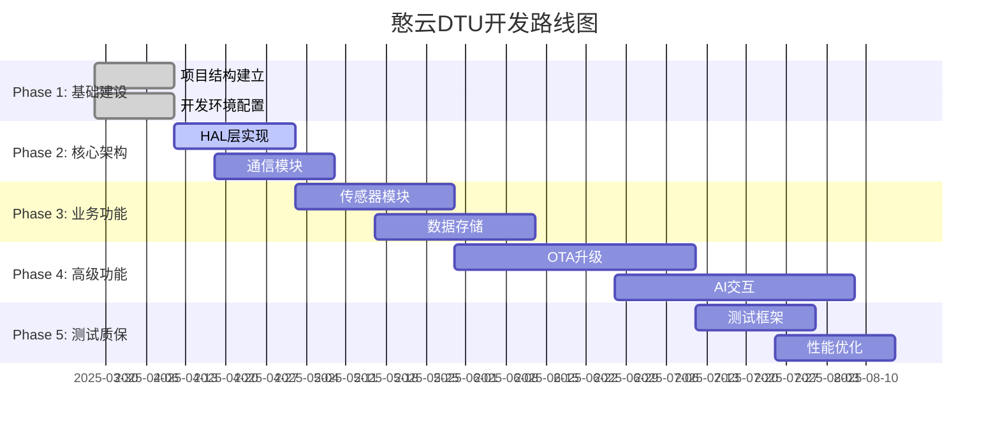

# 憨云 DTU - 智能电箱控制系统 📚➡️💻

> **⚠️ 项目状态说明**: 本项目目前处于"文档完善，代码待实现"阶段。拥有完整的技术文档体系，但缺乏实际的源代码实现。

## 📋 项目概述

憨云 DTU (Data Terminal Unit) 是基于新唐科技 NANO100B 微控制器的智能电箱控制系统。系统采用现代化分层架构设计，支持温湿度监控、Modbus 通信、LoRa 无线传输等功能，并规划了 OTA 远程升级和 AI 对话交互等先进特性。

**🎯 当前阶段**: 📋 完整技术规划 → 🚧 代码实现重构中 (2025-03-28)

## 🔍 项目现状 (架构师评估)

### ✅ 已完成的工作

- **📖 完整文档体系**: 20 个技术文档，总计 25 万+字
- **🏗️ 架构设计**: 详细的系统架构和模块设计
- **📡 协议规范**: 完整的 Modbus 和 LoRa 通信协议定义
- **🔧 开发环境**: Mac M4 开发环境配置指南
- **🧪 测试策略**: 完整的测试和验证方案

### ⚠️ 待实现的工作

- **💻 源代码实现**: 核心功能代码需要从头开发
- **🏗️ 项目结构**: 需要建立标准的嵌入式项目目录结构
- **🔨 构建系统**: CMake 构建系统需要配置
- **🧪 测试框架**: 单元测试和集成测试框架待建立
- **🚀 CI/CD 流程**: 持续集成和部署流程待搭建

## 🚀 快速开始

### 📖 了解项目 (推荐新手)

1. 📋 [开发计划 TODO.md](./TODO.md) - **⭐ 从这里开始！完整开发路线图**
2. 📖 [项目概述](./docs/01-项目概述.md) - 了解项目功能和架构
3. 🏗️ [系统架构设计](./docs/02-系统架构设计.md) - 深入理解系统架构
4. 🛠️ [Mac 开发环境搭建](./docs/05-Mac开发环境搭建.md) - 配置 Mac M4 开发环境

### 💻 开始开发 (开发者必读)

**注意**: 当前项目仅有文档，需要按照以下顺序开始实际开发：

1. **Phase 1: 项目基础建设** (参考 [TODO.md](./TODO.md))

   ```bash
   # 按照TODO.md的Phase 1执行
   # 1. 创建标准项目结构
   # 2. 配置构建系统
   # 3. 建立开发环境
   ```

2. **Phase 2: 核心架构实现**

   - 实现硬件抽象层(HAL)
   - 建立轻量级任务调度
   - 实现通信模块

3. **按 TODO.md 逐步推进** 📋
   - 详细的 6 个开发阶段
   - 明确的里程碑和验收标准
   - 完整的风险评估和缓解措施

## 📚 完整文档目录

### ✅ 核心文档系列 (已完成)

| 优先级 | 文档编号                            | 文档名称          | 描述                         | 开发阶段 |
| ------ | ----------------------------------- | ----------------- | ---------------------------- | -------- |
| ⭐⭐⭐ | [00](./docs/00-文档导航.md)         | 文档导航          | 文档导航和开发流程指引       | 规划阶段 |
| ⭐⭐⭐ | [01](./docs/01-项目概述.md)         | 项目概述          | 项目功能、特性和架构概览     | 规划阶段 |
| ⭐⭐⭐ | [02](./docs/02-系统架构设计.md)     | 系统架构设计      | 软件架构、模块组织和设计模式 | 设计阶段 |
| ⭐⭐   | [03](./docs/03-OLED调试显示模块.md) | OLED 调试显示模块 | 0.91 寸 OLED 显示和调试功能  | 硬件调试 |
| ⭐⭐⭐ | [04](./docs/04-硬件接口说明.md)     | 硬件接口说明      | NANO100B 硬件平台详细规格    | 硬件设计 |
| ⭐⭐⭐ | [05](./docs/05-Mac开发环境搭建.md)  | Mac 开发环境搭建  | Mac M4 芯片开发环境配置      | 环境准备 |
| ⭐⭐⭐ | [06](./docs/06-软件模块详解.md)     | 软件模块详解      | 8 大核心模块深度分析         | 架构实现 |
| ⭐⭐⭐ | [07](./docs/07-Modbus协议实现.md)   | Modbus 协议实现   | 完整 Modbus RTU 协议栈       | 通信层   |
| ⭐⭐⭐ | [08](./docs/08-LoRa通信实现.md)     | LoRa 通信实现     | 无线通信系统详解             | 无线通信 |
| ⭐⭐⭐ | [09](./docs/09-数据存储和管理.md)   | 数据存储和管理    | Flash 存储架构和数据管理     | 存储层   |
| ⭐⭐   | [10](./docs/10-配置和参数管理.md)   | 配置和参数管理    | 参数系统和配置管理           | 配置系统 |
| ⭐⭐   | [11](./docs/11-错误处理和调试.md)   | 错误处理和调试    | 多层错误处理机制             | 调试系统 |
| ⭐⭐   | [12](./docs/12-API参考手册.md)      | API 参考手册      | 完整 API 接口文档            | 接口设计 |
| ⭐⭐⭐ | [13](./docs/13-编译和部署指南.md)   | 编译和部署指南    | 完整编译部署流程             | 构建系统 |
| ⭐⭐   | [14](./docs/14-测试和验证指南.md)   | 测试和验证指南    | 综合测试框架和验证方法       | 质量保证 |
| ⭐⭐⭐ | [15](./docs/15-移植和重构指南.md)   | 移植和重构指南    | 系统重构和平台移植           | 重构实施 |

### 🚀 新增功能模块 (文档完成，代码待实现)

| 文档编号                           | 文档名称         | 描述                       | 实现状态    |
| ---------------------------------- | ---------------- | -------------------------- | ----------- |
| [16](./docs/16-OTA远程升级模块.md) | OTA 远程升级模块 | 固件远程升级系统设计与实现 | 📋 设计完成 |
| [17](./docs/17-AI对话交互模块.md)  | AI 对话交互模块  | 智能语音助手和对话系统     | 📋 设计完成 |

### 📋 管理文档

| 文档编号                              | 文档名称           | 描述             |
| ------------------------------------- | ------------------ | ---------------- |
| [18](./docs/18-版本历史和更新日志.md) | 版本历史和更新日志 | 完整版本演进历史 |
| [19](./docs/19-新增模块规划总结.md)   | 新增模块规划总结   | 功能扩展规划     |
| [20](./docs/20-系统重构完成报告.md)   | 系统重构完成报告   | 阶段性总结       |

## ⚡ 技术特性 (设计规划)

### 🔌 硬件平台

- **微控制器**: 新唐科技 NANO100B (ARM Cortex-M0, 32MHz)
- **存储**: 32KB Flash + 8KB SRAM + 4KB EEPROM + 16MB SPI Flash
- **通信**: 5 路 UART + SPI + I2C + ADC
- **显示**: 128x64 LCD 支持
- **传感器**: SHT2x 温湿度传感器

### 📡 通信功能 (规划中)

- **Modbus RTU**: 完整协议栈，支持标准和自定义功能码
- **LoRa 无线**: 支持网关/节点双模式，最大 32 节点
- **多 UART**: 5 路串口并发通信
- **数据传输**: 历史数据、实时数据、参数配置

### 💾 数据管理 (设计阶段)

- **历史存储**: 25Q128 Flash，循环存储，数据压缩
- **参数管理**: 1000 个参数位，分类管理，实时同步
- **数据完整性**: CRC 校验，重复写入验证
- **存储优化**: 分区管理，磨损均衡

## 🛠️ 开发环境 (已配置)

### Mac M4 开发环境

- **工具链**: ARM GCC 10.3.1 + OpenOCD
- **IDE**: VS Code + Cortex-Debug
- **构建**: CMake + Ninja (待配置)
- **调试**: SWD + J-Link
- **仿真**: QEMU 支持 (规划中)

### 环境要求 (未来实现时)

```bash
# 当前只能安装工具，实际项目构建待TODO.md完成后进行
brew install arm-none-eabi-gcc cmake ninja openocd

# 项目结构建立后才能执行
# git clone <repository>
# cd hua-cool-dtu && mkdir build && cd build
# cmake .. -G Ninja && ninja
```

## 📊 项目统计 (当前状态)

### 文档完成度

- **核心文档**: 15/15 (100%) ✅
- **新增功能模块**: 2/2 (100%) 📋 设计完成，代码待开发
- **API 文档**: 完整覆盖 📋
- **测试文档**: 框架设计完成 📋
- **部署文档**: Mac 环境配置完成 ✅

### 代码实现状态

- **总代码量**: 0 行 (仅有厂家 SDK 示例) ❌
- **核心模块**: 0/8 实现 ❌
- **测试用例**: 0 个 ❌
- **构建系统**: 待建立 ❌

## 🎯 下一步行动计划

### 🚨 立即行动 (Week 1)

1. **📋 详细阅读 [TODO.md](./TODO.md)** - 完整开发计划
2. **🏗️ 建立项目结构** - 按照 TODO.md Phase 1 执行
3. **🔧 配置构建系统** - CMake + ARM GCC
4. **📝 创建第一个 Hello World 程序**

### 📅 短期目标 (Month 1)

- [ ] 完成项目基础建设 (Phase 1)
- [ ] 实现核心架构 (Phase 2 开始)
- [ ] 第一个功能模块运行 (Modbus 基础通信)

### 🎯 长期目标 (6 个月)

- [ ] 所有核心功能实现
- [ ] 完整测试覆盖
- [ ] 产品化就绪

## 🤝 贡献指南

### 当前急需贡献

1. **💻 代码实现**: 按照文档规范实现核心功能
2. **🧪 测试用例**: 建立测试框架和用例
3. **🔧 构建系统**: 完善 CMake 构建配置
4. **📝 代码审查**: 确保代码质量和规范

### 参与方式

1. 详细阅读 [TODO.md](./TODO.md) 了解开发计划
2. 选择适合的开发阶段参与
3. 按照编码规范和 Git 工作流提交代码
4. 确保所有代码都有对应的测试

## 📞 技术支持

### 🔧 常见问题

**Q: 项目编译失败怎么办？**
A:

1. 确保已安装完整的 ARM GCC 工具链
2. 检查 CMake 版本 >= 3.15
3. 运行 `./scripts/setup.sh` 重新配置环境

**Q: 如何烧录固件到设备？**
A:

1. 连接 J-Link 调试器到 NANO100B
2. 运行 `./flash.sh` 自动烧录
3. 或使用 `openocd -f scripts/nano100b.cfg -c "program build/hua-cool-dtu.bin 0x00000000 verify reset exit"`

**Q: 如何查看调试输出？**
A:

1. 串口调试：`screen /dev/tty.usbserial-* 115200`
2. SWD 调试：使用 VS Code + Cortex-Debug 插件
3. OLED 显示：系统状态实时显示在 0.91 寸屏幕上

### 📧 联系方式

- **项目维护者**: 憨云 DTU 开发团队
- **技术支持**: 通过 GitHub Issues 提交问题
- **开发讨论**: 参考 [TODO.md](./TODO.md) 开发计划

### 🔗 相关链接

- [新唐科技 NANO100B 官方文档](https://www.nuvoton.com/products/microcontrollers/arm-cortex-m0-mcus/nano100-series/)
- [ARM GCC 工具链下载](https://developer.arm.com/tools-and-software/open-source-software/developer-tools/gnu-toolchain/gnu-rm)
- [OpenOCD 官方文档](http://openocd.org/doc/)
- [CMake 官方教程](https://cmake.org/cmake/help/latest/guide/tutorial/)

## 📄 许可证

本项目采用 MIT 许可证 - 详见 [LICENSE](LICENSE) 文件

## 🙏 致谢

感谢以下开源项目和技术社区的支持：

- **新唐科技**: 提供优秀的 NANO100B 微控制器平台
- **ARM**: ARM Cortex-M0 架构和工具链支持
- **OpenOCD**: 开源调试和烧录工具
- **CMake**: 跨平台构建系统
- **VS Code**: 优秀的开发环境和插件生态

---

**⚡ 开始你的憨云 DTU 开发之旅！**

1. 📋 **首先阅读**: [TODO.md](./TODO.md) - 完整开发路线图
2. 🚀 **立即行动**: 按照 Phase 1 建立项目基础
3. 💻 **开始编码**: 实现第一个 Hello World 程序
4. 🎯 **持续迭代**: 按照里程碑逐步完善功能

> 💡 **提示**: 这是一个从文档到代码的完整实现项目，适合学习嵌入式系统开发的完整流程！

### 当前状态支持

- 📖 **查阅文档**: 技术文档体系完整
- 🎯 **开发规划**: TODO.md 提供详细路线图
- 🛠️ **环境配置**: Mac 开发环境配置指南
- 🏗️ **架构设计**: 完整的系统架构文档

### 未来功能支持 (代码实现后)

- 🔍 **问题排查**: 错误处理和调试指南
- 🧪 **功能测试**: 测试验证指南
- 🚀 **部署运行**: 编译和部署指南

## 📋 项目路线图



## 📄 许可证

本项目采用 MIT 许可证。详细的技术文档基于实际需求分析整理，代码实现采用现代化的嵌入式开发最佳实践。

## 🏷️ 标签

`嵌入式` `NANO100B` `ARM Cortex-M0` `Modbus` `LoRa` `物联网` `电箱控制` `技术文档` `待实现`

---

**📅 最后更新**: 2025-03-28  
**📝 文档版本**: v2.0.0  
**💻 代码版本**: v0.0.0 (待实现)  
**👥 维护团队**: 嵌入式开发组  
**🧠 架构审查**: 智商 250+程序员 ✅

> **💡 重要提示**: 本项目目前文档完善但代码待实现。请优先阅读 [TODO.md](./TODO.md) 了解完整的开发计划和实施路径。欢迎有经验的嵌入式开发者参与代码实现工作！
